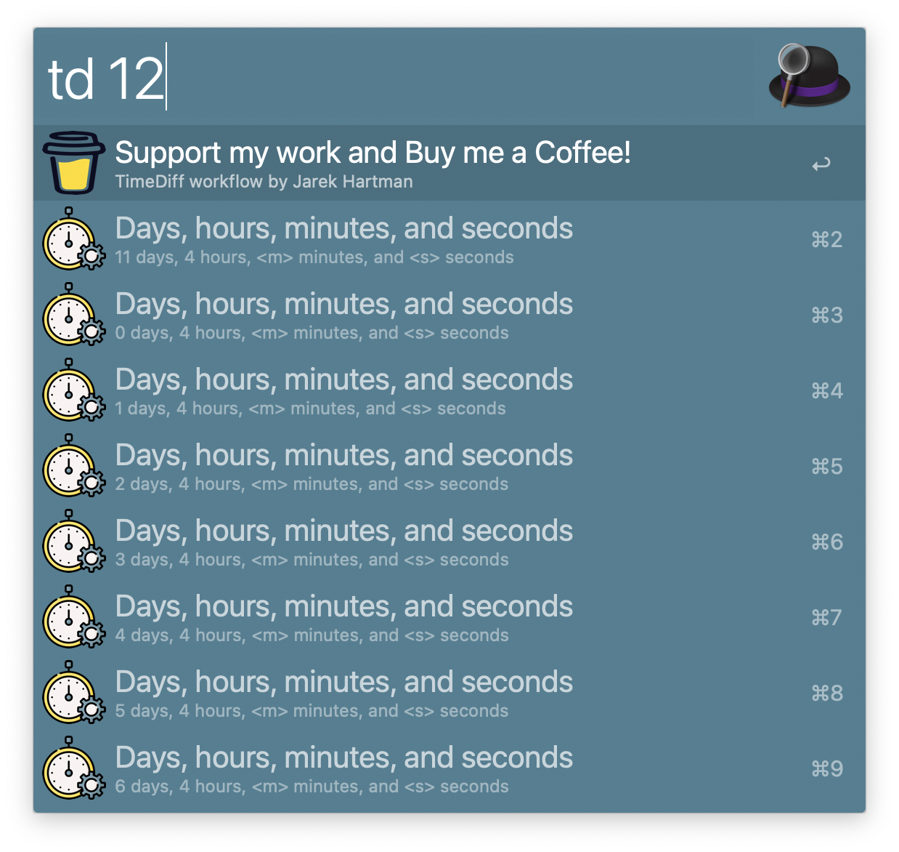
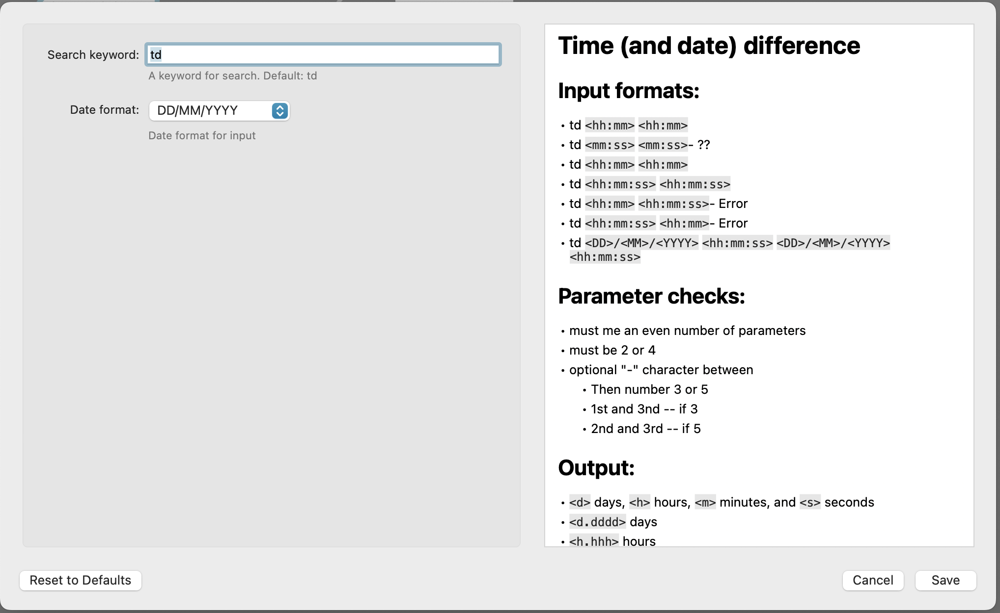

# Time (and date) difference
(Yet) another time/date diff workflow for Alfred

**WORK IN PROGRESS -- NOTHING USEFUL YET**

# Design and Requirements

Below list of requirements and design considerations

## Frontend

Workflow for Alfred 5. Project:

## Backend

Developed in `golang`.

## Input components

Time component formats `<time>`:
 - `<ss>`
 - `<mm:ss>`
 - `<hh:mm:ss>`

Date component formats `<date>`:
 - If configured `DD/MM/YYYY`
     - `<DD>/<MM>`
     - `<DD>/<MM>/<YYYY>`
 - If configured `MM/DD/YYYY`
     - `<MM>/<DD>`
     - `<MM>/<DD>/<YYYY>`

Compount duration component `<period>`:
 - `<d>d<h>h<m>m<s>s`
 - Any component can be ommited, e.g. `1d4h`

## Valid queries
- Duration span (difference)
    - `td <time> <time>` - time difference
    - `td <date> <time> <date> <time>` - time difference
- Span calculations, where `<op>` can be `-` or `+`:
    - `td <time> <op> <time>`
    - `td <date> <time> <op> <time>`
    - `td <time> <op> <period>`
    - `td <date> <time> <op> <period>`

## Output:
- `<d>` days, `<h>` hours, `<m>` minutes, and `<s>` seconds
- `<d.ddd>` days
- `<h.hh>` hours
- `<m.mm>` minutes
- `<s>` seconds
- If `<date>` specified, a date will be returned
    - `DD/MM/YYYY hh:mm:ss`, or
    - `MM/DD/YYYY hh:mm:ss`

## Unit formatted for singular/plural:
- day/days
- hour/hours
- minut/minutes
- second/seconds

Additionally:
- `0,2,...` is plural, `1` is singular)
- Numbers formatted with thusdands separators, e.g.:
- `999`
- `1,234`
- `1,234,567`
- `1,234,567.890`

## Configurations:

Based on Alfred 5 workflow configuration https://www.alfredapp.com/help/workflows/workflow-configuration/

- Search Key - default `td`
- Date formats
    - `DD/MM/YYYY`
    - `DD/MM`
    - `MM/DD/YYYY`
    - `MM/DD`

## OneUpdater support

Must-have!

# References
* Icon - https://www.flaticon.com/free-icon/duration_5116345
* https://www.alfredapp.com/help/workflows/inputs/script-filter/json/
